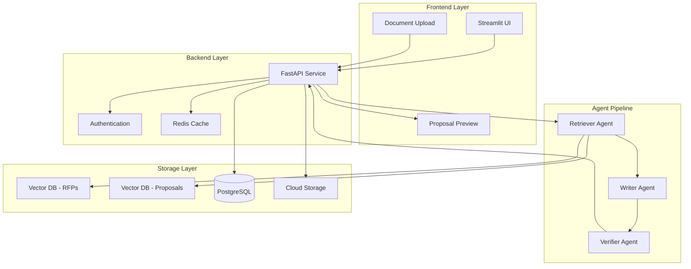
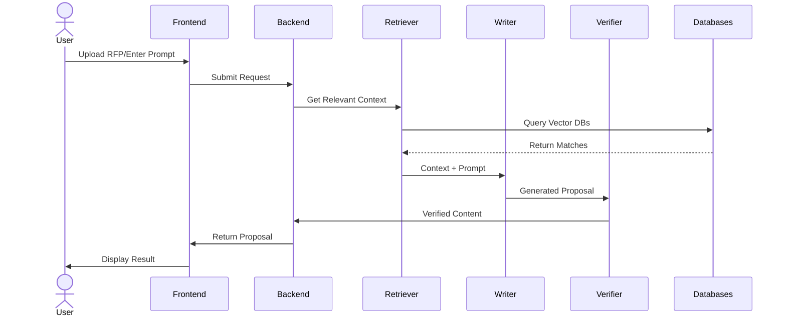

# Propulse: AI-Powered Proposal Generation System

Propulse is a multi-agent system that leverages AI to generate high-quality proposals based on user prompts and RFP documents. The system uses vector databases to retrieve relevant context from past RFPs and proposals, ensuring generated content is both accurate and contextually appropriate.

## 🌟 Features

- **Smart Prompt Processing**: Accept user-written prompts describing proposal requirements
- **Document Upload**: Support for PDF/DOCX RFP document uploads
- **Dual Vector Database**: Separate databases for past RFPs and proposals
- **Three-Stage Agent Pipeline**:
  - Retriever Agent: Finds relevant content from vector DBs
  - Writer Agent: Generates proposals using context and persona
  - Verifier Agent: Ensures factual accuracy and compliance
- **Modern Tech Stack**: Built with FastAPI, Streamlit, and Google Cloud Platform

## 🏗️ Architecture

### System Architecture


### Workflow Diagram


## 📁 Detailed Project Structure

```
Propulse/
├── backend/                 # FastAPI backend service
│   ├── agents/             # Agent implementations
│   │   ├── retriever/      # Retriever agent logic
│   │   │   ├── __init__.py
│   │   │   ├── agent.py
│   │   │   └── utils.py
│   │   ├── writer/         # Writer agent logic
│   │   │   ├── __init__.py
│   │   │   ├── agent.py
│   │   │   └── templates.py
│   │   └── verifier/       # Verifier agent logic
│   │       ├── __init__.py
│   │       ├── agent.py
│   │       └── rules.py
│   ├── api/                # API endpoints
│   │   ├── v1/
│   │   │   ├── __init__.py
│   │   │   ├── auth.py
│   │   │   ├── proposals.py
│   │   │   └── users.py
│   │   └── middleware/
│   ├── core/               # Core business logic
│   │   ├── config/
│   │   ├── models/
│   │   └── services/
│   ├── logs/              # Log files
│   └── main.py
├── frontend/              # Streamlit frontend
│   ├── assets/           # Static assets
│   │   ├── css/
│   │   └── img/
│   ├── components/       # Reusable components
│   │   ├── upload/
│   │   ├── prompt/
│   │   └── preview/
│   ├── pages/           # Application pages
│   │   ├── home.py
│   │   ├── generate.py
│   │   └── history.py
│   └── main.py
├── shared/              # Shared resources
│   ├── mcp_schemas/    # MCP protocol schemas
│   │   ├── input/
│   │   └── output/
│   ├── sample_rfps/    # Sample RFP documents
│   └── templates/      # Proposal templates
├── infra/              # Infrastructure code
│   ├── gcp/           # GCP configurations
│   │   ├── backend/
│   │   └── frontend/
│   └── terraform/     # Terraform configurations
├── scripts/           # Utility scripts
│   ├── setup.sh
│   └── cleanup.sh
├── .github/           # GitHub configurations
│   └── workflows/     # CI/CD workflows
├── tests/            # Test suite
│   ├── unit/
│   └── integration/
├── .env.example      # Environment variables template
├── environment.yml   # Conda environment file
├── .gitignore       # Git ignore rules
└── README.md        # Project documentation
```

## 🚀 Quick Start

1. **Clone the Repository**
   ```bash
   git clone https://github.com/nerdy1texan/propulse.git
   cd propulse
   ```

2. **Set Up Environment**
   
   For Windows Git Bash:
   ```bash
   # Initialize conda in Git Bash (do this once)
   source ~/anaconda3/etc/profile.d/conda.sh

   # Create and activate conda environment
   conda env create -f environment.yml
   conda activate propulse
   ```

   For other terminals:
   ```bash
   # Create and activate conda environment
   conda env create -f environment.yml
   conda activate propulse
   ```

3. **Configure Environment Variables**
   ```bash
   cp .env.example .env
   # Edit .env with your configuration
   ```

4. **Start Services**
   ```bash
   # Start backend
   cd backend
   uvicorn main:app --reload

   # In another terminal, start frontend
   cd frontend
   streamlit run main.py
   ```

## 🛠️ Development

1. **Install Development Dependencies**
   ```bash
   pip install -r requirements-dev.txt
   ```

2. **Run Tests**
   ```bash
   pytest
   ```

3. **Code Quality**
   ```bash
   black .
   isort .
   flake8
   ```

## 🧹 Cleanup

To clean up containers, logs, and build artifacts:
```bash
bash scripts/cleanup.sh
```

## 📚 Documentation

- [Backend API Documentation](backend/README.md)
- [Frontend Documentation](frontend/README.md)
- [Infrastructure Setup](infra/README.md)
- [Agent System](backend/agents/README.md)

## 🤝 Contributing

1. Fork the repository
2. Create a feature branch
3. Commit your changes
4. Push to the branch
5. Create a Pull Request

## 📄 License

This project is licensed under the MIT License - see the [LICENSE](LICENSE) file for details.

## 🔗 Links

- [Issue Tracker](https://github.com/yourusername/propulse/issues)
- [Project Wiki](https://github.com/yourusername/propulse/wiki)

## 👥 Team

- Project Lead: [Your Name](https://github.com/yourusername)
- Contributors: [See all contributors](https://github.com/yourusername/propulse/graphs/contributors) # Propulse
