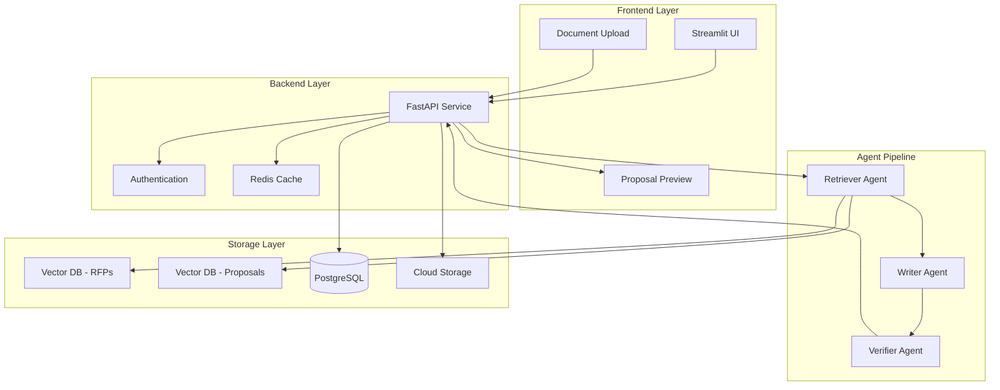
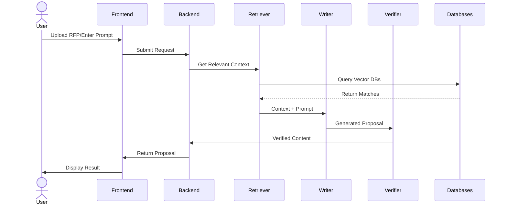

# Propulse: AI-Powered Proposal Generation System

Propulse is a multi-agent system that leverages AI to generate high-quality proposals based on user prompts and RFP documents. The system uses vector databases to retrieve relevant context from past RFPs and proposals, ensuring generated content is both accurate and contextually appropriate.

## 🌟 Features

- **Smart Prompt Processing**: Accept user-written prompts describing proposal requirements
- **Document Upload**: Support for PDF/DOCX RFP document uploads
- **Dual Vector Database**: Separate databases for past RFPs and proposals
- **Three-Stage Agent Pipeline**:
  - Retriever Agent: Finds relevant content from vector DBs
  - Writer Agent: Generates proposals using context and persona
  - Verifier Agent: Ensures factual accuracy and compliance
- **Modern Tech Stack**: Built with FastAPI, Streamlit, and Google Cloud Platform

## 🚀 Quick Start

1. **Clone the Repository**
   ```bash
   git clone https://github.com/nerdy1texan/propulse.git
   cd propulse
   ```

2. **Set Up Environment**
   
   For Windows Git Bash:
   ```bash
   # Initialize conda in Git Bash (do this once)
   source ~/anaconda3/etc/profile.d/conda.sh

   # Create and activate conda environment
   conda env create -f environment.yml
   conda activate propulse
   ```

   For other terminals:
   ```bash
   # Create and activate conda environment
   conda env create -f environment.yml
   conda activate propulse
   ```

3. **Configure Environment Variables**
   ```bash
   cp .env.example .env
   # Edit .env with your configuration
   ```

4. **Start Services**
   ```bash
   # Start backend
   cd backend
   uvicorn main:app --reload

   # In another terminal, start frontend
   cd frontend
   streamlit run main.py
   ```

## 🏗️ Architecture

### System Architecture


### Workflow Diagram


## 📁 Detailed Project Structure

```
Propulse/
├── backend/                 # FastAPI backend service
│   ├── agents/             # Agent implementations
│   │   ├── retriever/      # Retriever agent logic
│   │   │   ├── __init__.py
│   │   │   ├── agent.py
│   │   │   └── utils.py
│   │   ├── writer/         # Writer agent logic
│   │   │   ├── __init__.py
│   │   │   ├── agent.py
│   │   │   └── templates.py
│   │   └── verifier/       # Verifier agent logic
│   │       ├── __init__.py
│   │       ├── agent.py
│   │       └── rules.py
│   ├── api/                # API endpoints
│   │   ├── v1/
│   │   │   ├── __init__.py
│   │   │   ├── auth.py
│   │   │   ├── proposals.py
│   │   │   └── users.py
│   │   └── middleware/
│   ├── core/               # Core business logic
│   │   ├── config/
│   │   ├── models/
│   │   └── services/
│   ├── logs/              # Log files
│   └── main.py
├── frontend/              # Streamlit frontend
│   ├── assets/           # Static assets
│   │   ├── css/
│   │   └── img/
│   ├── components/       # Reusable components
│   │   ├── upload/
│   │   ├── prompt/
│   │   └── preview/
│   ├── pages/           # Application pages
│   │   ├── home.py
│   │   ├── generate.py
│   │   └── history.py
│   └── main.py
├── shared/              # Shared resources
│   ├── mcp_schemas/    # MCP protocol schemas
│   │   ├── input/
│   │   └── output/
│   ├── sample_rfps/    # Sample RFP documents
│   └── templates/      # Proposal templates
├── infra/              # Infrastructure code
│   ├── gcp/           # GCP configurations
│   │   ├── backend/
│   │   └── frontend/
│   └── terraform/     # Terraform configurations
├── scripts/           # Utility scripts
│   ├── setup.sh
│   └── cleanup.sh
├── .github/           # GitHub configurations
│   └── workflows/     # CI/CD workflows
├── tests/            # Test suite
│   ├── unit/
│   └── integration/
├── .env.example      # Environment variables template
├── environment.yml   # Conda environment file
├── .gitignore       # Git ignore rules
└── README.md        # Project documentation
```

## 🔑 Key Features

### Implemented Components ✅

#### **Retriever Agent (Prompt 2)**
- **Dual Vector Search**: Simultaneously queries RFP and proposal vector databases
- **Multi-Format Support**: Processes PDF, DOCX, and TXT documents
- **Smart Text Chunking**: Intelligent document segmentation with overlapping windows
- **MCP Compliance**: Follows Model Context Protocol for standardized I/O
- **Real-time Logging**: Comprehensive JSONL logs with retrieval metadata
- **Error Resilience**: Graceful handling of missing files or processing errors
- **Flexible Querying**: Supports text-only, document-only, or combined queries
- **Embedding Models**: Uses Sentence Transformers for semantic similarity
- **FAISS Integration**: High-performance vector similarity search
- **GPU Acceleration**: Optional GPU support for faster processing

#### **Text Processing Pipeline**
- **PDF Extraction**: Advanced PDF text extraction with page preservation
- **DOCX Processing**: Complete DOCX parsing including tables and paragraphs
- **Text Normalization**: Intelligent cleaning and formatting
- **Metadata Preservation**: Maintains source file information and processing timestamps

#### **Vector Database Management**
- **Automated Building**: Scripts to build vector databases from document collections
- **Index Management**: FAISS index creation and optimization
- **Metadata Storage**: JSON-based chunk and database metadata
- **Version Control**: Timestamped database builds with provenance tracking

### Upcoming Components 🚧
- Writer Agent: Context-aware proposal generation
- Verifier Agent: Hallucination detection and fact-checking
- API Integration: RESTful endpoints for agent coordination
- Frontend Interface: Streamlit-based user interface
- Cloud Deployment: GCP Cloud Run deployment pipeline

## 💻 Usage Commands

### Environment Setup
```bash
# Initialize conda in Git Bash (Windows)
source ~/anaconda3/etc/profile.d/conda.sh

# Create and activate environment
conda env create -f environment.yml
conda activate propulse

# Copy environment variables template
cp .env.example .env
# Edit .env with your configuration
```

### Vector Database Operations
```bash
# Build vector databases from sample documents
python scripts/build_vector_db.py

# Build with custom paths
python scripts/build_vector_db.py \
  --rfp-dir shared/sample_rfps \
  --proposal-dir shared/templates \
  --output-dir data/vector_dbs

# Build with GPU acceleration
python scripts/build_vector_db.py --gpu

# Use different embedding model
python scripts/build_vector_db.py --model all-mpnet-base-v2
```

### Retriever Agent Usage
```python
# Basic retrieval example
from backend.agents.retriever_agent import RetrieverAgent, QueryInput

# Initialize agent
agent = RetrieverAgent(
    rfp_db_path="data/vector_dbs/rfp_db",
    proposal_db_path="data/vector_dbs/proposal_db"
)

# Text-only query
query = QueryInput(
    text="Need web application development with user authentication",
    top_k=5,
    similarity_threshold=0.2
)
result = agent.retrieve(query)

# Query with document upload
query_with_doc = QueryInput(
    text="Software development project",
    document_path="path/to/rfp.pdf",
    top_k=10
)
result = agent.retrieve(query_with_doc)

# Save results
agent.save_result(result)
```

### Testing
```bash
# Run all tests
pytest

# Run specific test file
pytest tests/test_retriever.py -v

# Run with coverage
pytest --cov=backend tests/

# Run only unit tests (skip integration)
pytest -m "not integration"
```

### Development Tools
```bash
# Code formatting
black .
isort .

# Linting
flake8

# Type checking
mypy backend/

# Pre-commit hooks
pre-commit install
pre-commit run --all-files
```

### Service Management
```bash
# Start backend service
cd backend
uvicorn main:app --reload --port 8000

# Start frontend (in separate terminal)
cd frontend  
streamlit run main.py

# View API documentation
# http://localhost:8000/docs
```

### Logging and Monitoring
```bash
# View retriever logs
tail -f logs/retriever_log.jsonl

# Monitor vector database build
tail -f logs/vector_db_build.log

# Clean up logs and artifacts
bash scripts/cleanup.sh
```

### Infrastructure Management
```bash
# Deploy to GCP (when implemented)
cd infra/terraform/prod
terraform init
terraform plan
terraform apply

# View cloud resources
gcloud run services list
gcloud storage ls
```

## 🏗️ Architecture

### System Architecture


### Workflow Diagram


## 📁 Detailed Project Structure

```
Propulse/
├── backend/                 # FastAPI backend service
│   ├── agents/             # Agent implementations
│   │   ├── retriever/      # Retriever agent logic
│   │   │   ├── __init__.py
│   │   │   ├── agent.py
│   │   │   └── utils.py
│   │   ├── writer/         # Writer agent logic
│   │   │   ├── __init__.py
│   │   │   ├── agent.py
│   │   │   └── templates.py
│   │   └── verifier/       # Verifier agent logic
│   │       ├── __init__.py
│   │       ├── agent.py
│   │       └── rules.py
│   ├── api/                # API endpoints
│   │   ├── v1/
│   │   │   ├── __init__.py
│   │   │   ├── auth.py
│   │   │   ├── proposals.py
│   │   │   └── users.py
│   │   └── middleware/
│   ├── core/               # Core business logic
│   │   ├── config/
│   │   ├── models/
│   │   └── services/
│   ├── logs/              # Log files
│   └── main.py
├── frontend/              # Streamlit frontend
│   ├── assets/           # Static assets
│   │   ├── css/
│   │   └── img/
│   ├── components/       # Reusable components
│   │   ├── upload/
│   │   ├── prompt/
│   │   └── preview/
│   ├── pages/           # Application pages
│   │   ├── home.py
│   │   ├── generate.py
│   │   └── history.py
│   └── main.py
├── shared/              # Shared resources
│   ├── mcp_schemas/    # MCP protocol schemas
│   │   ├── input/
│   │   └── output/
│   ├── sample_rfps/    # Sample RFP documents
│   └── templates/      # Proposal templates
├── infra/              # Infrastructure code
│   ├── gcp/           # GCP configurations
│   │   ├── backend/
│   │   └── frontend/
│   └── terraform/     # Terraform configurations
├── scripts/           # Utility scripts
│   ├── setup.sh
│   └── cleanup.sh
├── .github/           # GitHub configurations
│   └── workflows/     # CI/CD workflows
├── tests/            # Test suite
│   ├── unit/
│   └── integration/
├── .env.example      # Environment variables template
├── environment.yml   # Conda environment file
├── .gitignore       # Git ignore rules
└── README.md        # Project documentation
```

## 🚀 Quick Start

1. **Clone the Repository**
   ```bash
   git clone https://github.com/nerdy1texan/propulse.git
   cd propulse
   ```

2. **Set Up Environment**
   
   For Windows Git Bash:
   ```bash
   # Initialize conda in Git Bash (do this once)
   source ~/anaconda3/etc/profile.d/conda.sh

   # Create and activate conda environment
   conda env create -f environment.yml
   conda activate propulse
   ```

   For other terminals:
   ```bash
   # Create and activate conda environment
   conda env create -f environment.yml
   conda activate propulse
   ```

3. **Configure Environment Variables**
   ```bash
   cp .env.example .env
   # Edit .env with your configuration
   ```

4. **Start Services**
   ```bash
   # Start backend
   cd backend
   uvicorn main:app --reload

   # In another terminal, start frontend
   cd frontend
   streamlit run main.py
   ```

## 🛠️ Development

1. **Install Development Dependencies**
   ```bash
   pip install -r requirements-dev.txt
   ```

2. **Run Tests**
   ```bash
   pytest
   ```

3. **Code Quality**
   ```bash
   black .
   isort .
   flake8
   ```

## 🧹 Cleanup

To clean up containers, logs, and build artifacts:
```bash
bash scripts/cleanup.sh
```

## 📚 Documentation

- [Backend API Documentation](backend/README.md)
- [Frontend Documentation](frontend/README.md)
- [Infrastructure Setup](infra/README.md)
- [Agent System](backend/agents/README.md)

## 🤝 Contributing

1. Fork the repository
2. Create a feature branch
3. Commit your changes
4. Push to the branch
5. Create a Pull Request

## 📄 License

This project is licensed under the MIT License - see the [LICENSE](LICENSE) file for details.

## 🔗 Links

- [Issue Tracker](https://github.com/yourusername/propulse/issues)
- [Project Wiki](https://github.com/yourusername/propulse/wiki)

## 👥 Team

- Project Lead: [Maulin Raval](https://github.com/nerdy1texan)
- Contributors: [See all contributors](https://github.com/yourusername/propulse/graphs/contributors)
